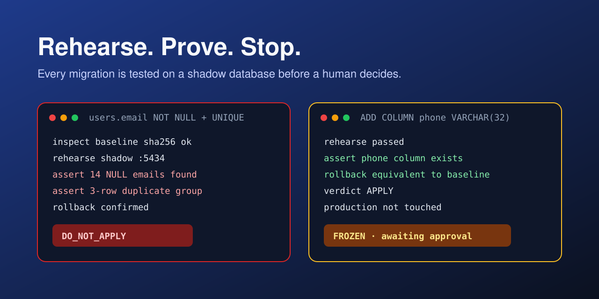
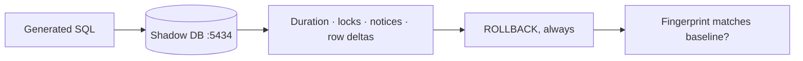
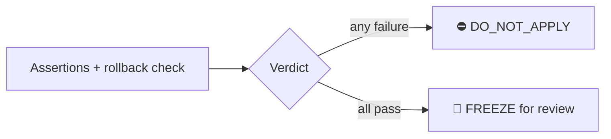
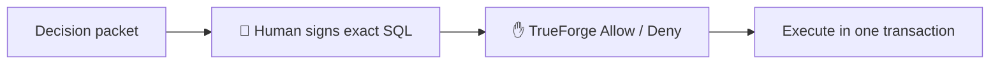
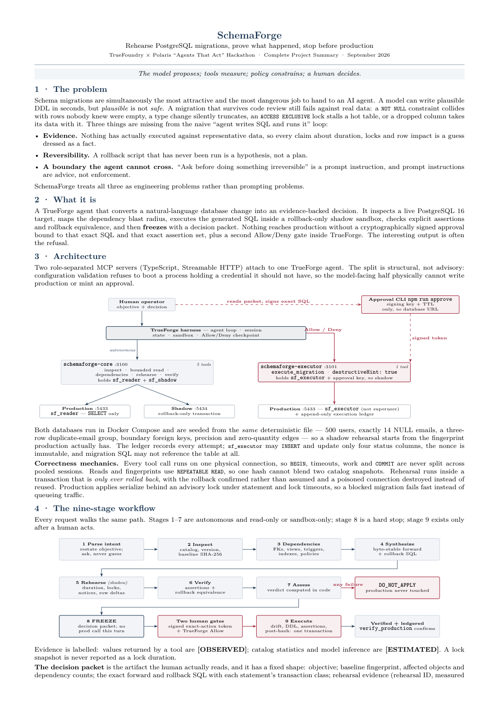
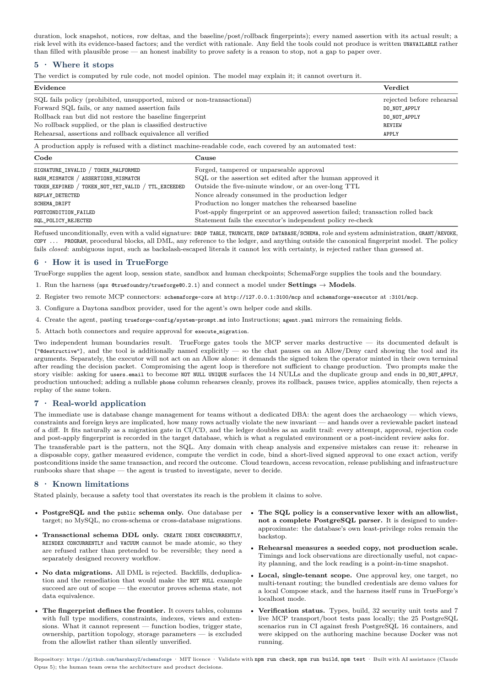
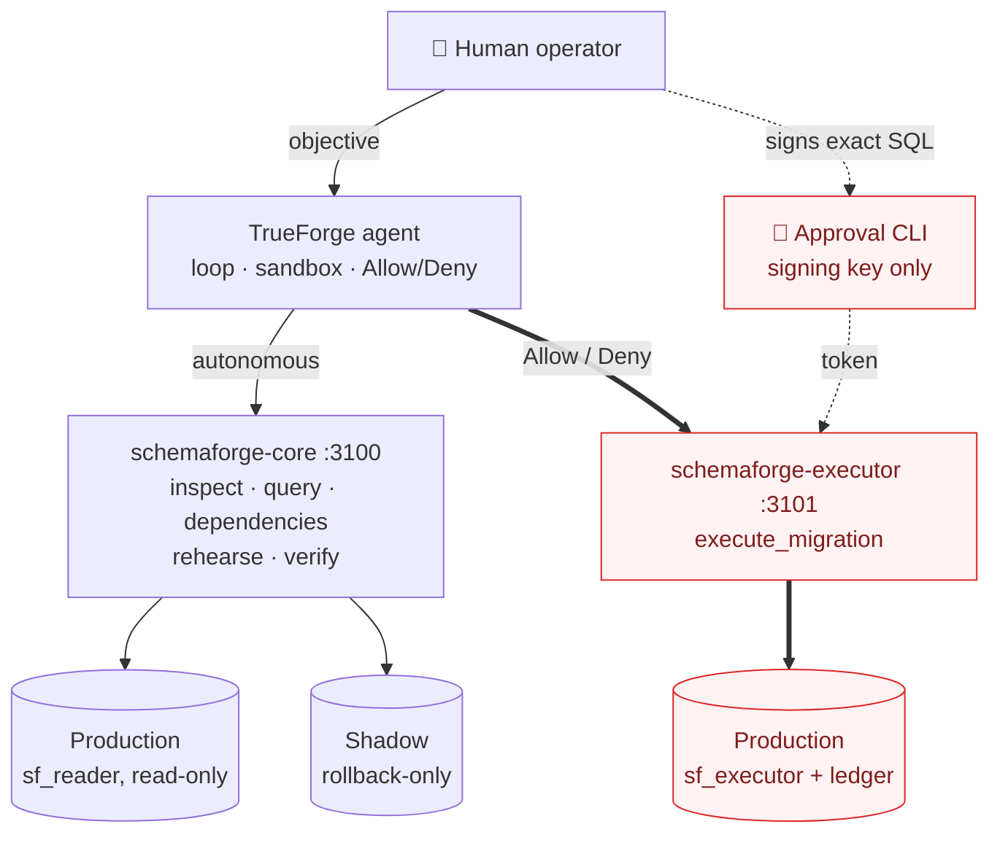
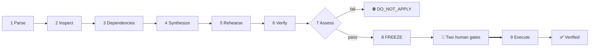
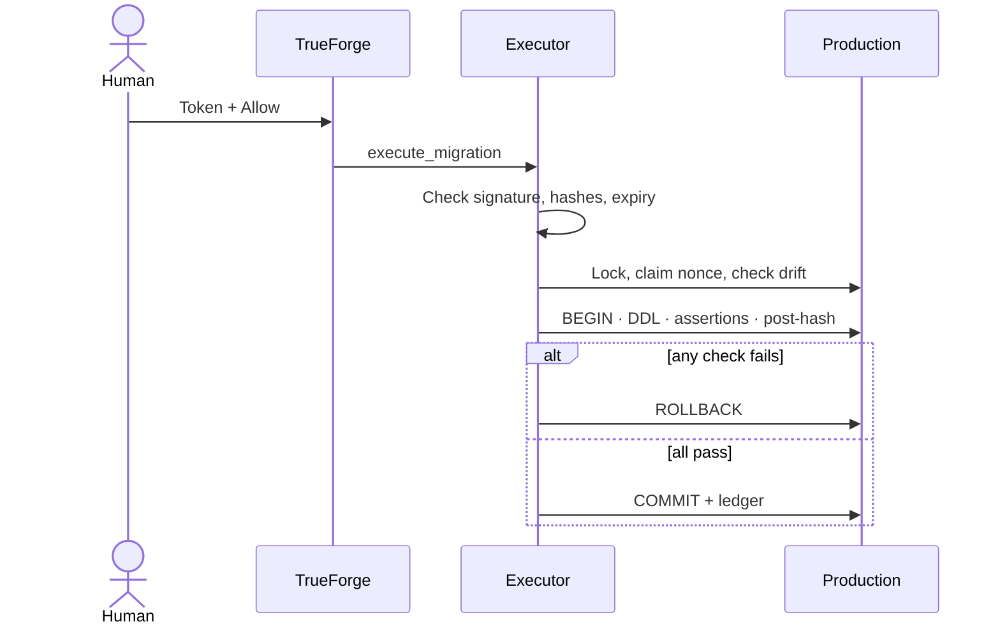

Language: EN

<p align="center">
  
</p>

<p align="center">
  
  
  
</p>

### Ship database migrations with evidence, not hope
**SchemaForge** is an **open-source migration agent** for **PostgreSQL** that rehearses every schema change on a shadow database, proves what happened, and **stops before production** until a human approves.
**Accepting PRs.**



---
### Built for Agents That Act
Built during the [TrueFoundry × Polaris "Agents That Act" hackathon](https://hackculture.io/hackathons/agents-that-act) and runs on [TrueForge](https://github.com/truefoundry/trueforge).

---

## What is SchemaForge?

SchemaForge is a TrueForge agent that turns a plain-English database change into an evidence-backed decision. Instead of letting a model write SQL and run it against production, SchemaForge inspects the real database, runs the change on a disposable copy, checks the result, and hands a human a decision packet. The most useful answer is often "no".

> The model proposes. Tools measure. Policy constrains. A human decides.

SchemaForge runs on:

- **TrueForge** 0.2.1 (local, `npx @truefoundry/trueforge`)
- **PostgreSQL** 16 (production and shadow, via Docker Compose)
- **Node.js** 22.14+ on Windows, macOS or Linux

Platform notes:

- **Core server** holds read-only and shadow credentials only. It cannot write production.
- **Executor server** holds the only production write role and exposes one destructive tool.
- **Approval CLI** holds the signing key and no database URL at all.

---

# Core Features

## Shadow rehearsal on real-shaped data
Every migration runs first on a shadow database seeded from the same file as production, inside a transaction that is always rolled back. SchemaForge records duration, locks, notices and row changes, then confirms the rollback actually happened.



## Knows when to stop
Assertions declare what must be true, and the verdict is computed in code. If any check fails, the answer is `DO_NOT_APPLY` and production is never touched.



## Two human gates before production
A human signs the exact SQL with a short-lived, single-use token outside the agent. TrueForge then pauses the destructive tool call with an Allow/Deny card. Change one byte of the SQL and the token stops working.



## Role separation you can't prompt around
Credentials are split across three processes, and each one refuses to start if it holds a secret it should not have. The part of the system the model talks to physically cannot write production.

---

## All Features

### Inspection

- Stable SHA-256 schema fingerprint of the live catalog
- Bounded read-only queries through the `sf_reader` role
- Dependency blast radius across foreign keys, views, triggers, functions, indexes and policies

### Rehearsal

- Forward SQL, assertions and rollback on one shadow session
- Outer `ROLLBACK` even on success
- Lock observation, notices and row-count deltas
- Rollback-equivalence check against the baseline fingerprint
- Poisoned connections destroyed instead of reused

### Verification

- Explicit assertion outcomes: `first_value_true`, `scalar_equals`, `returns_rows`, `returns_no_rows`
- A query that only runs without error never counts as a pass
- Verdict computed in code: `APPLY`, `REVIEW` or `DO_NOT_APPLY`

### SQL Policy

- Fail-closed, schema-only allowlist
- Blocks DML, procedural escape hatches, ledger access and ambiguous escaped literals
- Rejects mixed or non-transactional plans

### Approval

- HMAC-SHA256 token bound to the SQL hash, assertion hash, fingerprints, rehearsal ID and target
- Five-minute expiry and single-use nonce
- Second gate in TrueForge through `destructiveHint: true`

### Execution

- Drift check against the rehearsed baseline before any DDL
- Advisory lock, statement timeout and lock timeout
- DDL, assertions, post-fingerprint and ledger update in one transaction
- Replay attempts return `REPLAY_DETECTED`

### Workflow

- One-command TrueForge provisioning and a PASS/FAIL health check
- Deterministic demo seed with deliberate edge cases
- CI with build, secret scan, end-to-end tests and PDF build

---

# Screenshots

<p align="center">
  
</p>

<p align="center">
  
</p>

---

# Installation

## Build from source

### Prerequisites

- **Node.js** 22.14+
- **Docker Desktop** with Compose v2
- A **model credential** supported by TrueForge (added in the TrueForge UI, never in this repo)
- Optional: a **Daytona** credential for TrueForge's code sandbox

### Steps

```bash
git clone https://github.com/harshaxyZ/schemaforge.git
cd schemaforge
npm run setup
npm run build
cp config/core.env.example .env.core
cp config/executor.env.example .env.executor
cp config/approval.env.example .env.approval
```

Generate one signing secret and put the same value in `.env.executor` and `.env.approval`:

```bash
node -e "console.log(require('crypto').randomBytes(32).toString('hex'))"
```

Start the databases and both MCP servers (one terminal each):

```bash
docker compose up -d
npm run start:core        # http://127.0.0.1:3100/mcp
npm run start:executor    # http://127.0.0.1:3101/mcp
```

---

## Connect to TrueForge

Start TrueForge, open http://localhost:8790, and add your model under **Settings → Models**:

```bash
npx @truefoundry/trueforge@0.2.1
```

Then provision the connectors and agent:

```bash
node scripts/trueforge/provision.mjs --dry-run
node scripts/trueforge/provision.mjs --model openai/gpt-5.2
node scripts/trueforge/check.mjs
```

Every check should print `PASS`. See [`scripts/trueforge/README.md`](scripts/trueforge/README.md) for flags.

---

## "Connection refused" on :3100 or :3101

The MCP servers are not running, or they refused to start. Check the terminal output: a server exits on purpose if its env file holds a credential its role must not have.

```bash
curl http://127.0.0.1:3100/health
curl http://127.0.0.1:3101/health
```

---

# System Requirements

| Component | Minimum version | Notes |
|---|---|---|
| **Node.js** | 22.14 | Required by TrueForge. |
| **Docker** | Compose v2 | Runs production (:5433) and shadow (:5434). |
| **PostgreSQL** | 16 | Provided by the Compose file. |
| **TrueForge** | 0.2.1 | MCP connectors must be remote HTTP. |

> [!IMPORTANT]
> Never paste the signing secret into TrueForge, chat, source code or a demo video.

---

# Usage

## Ask

1. Open the SchemaForge agent in TrueForge.
2. Describe the change in plain English.
3. Ask it to prove the change is safe before applying anything.

> Make `users.email` NOT NULL and UNIQUE. Prove it is safe before applying anything.

## Review

SchemaForge inspects, maps dependencies, rehearses and verifies, then either refuses or freezes. In the demo seed, the request above finds 14 NULL emails and a three-row duplicate group, so the verdict is `DO_NOT_APPLY`.

A safe request, such as adding an optional `phone VARCHAR(32)` column, ends in a frozen decision packet with:

- the exact forward and rollback SQL
- the assertion set and results
- baseline and expected fingerprints
- the rehearsal ID

## Approve

Save the SQL and assertions from the packet, then sign them outside the agent:

```bash
npm run approve -- --sql-file migration.sql --assertions-file assertions.json \
  --baseline <BASELINE_SHA256> --expected <POST_SHA256> \
  --rehearsal-id <REHEARSAL_ID> --action "Add optional users.phone column" --confirm
```

Paste the token into a new TrueForge message and click **Allow** on the approval card. The executor applies the change and `verify_production` confirms it.

---

# Limitations

### Shadow role

The shadow rehearsal currently runs as a superuser, so some allowlisted DDL can have side effects that survive the rollback (SF-SEC-01). A non-superuser rehearsal role on an isolated network is planned.

### Read-only queries

The read-only query check is a denylist, so some dangerous built-ins pass (SF-SEC-02). Rollback-only reads with a pinned `search_path` are planned.

### MCP authentication

`/mcp` is unauthenticated when no API key is set (SF-SEC-03). Set `SF_MCP_API_KEY` for anything beyond a local demo.

Full details are in [`docs/review/security-review.md`](docs/review/security-review.md). Use local demo databases only until these are fixed.

---

# How It Works

SchemaForge combines a TrueForge agent loop with two role-separated MCP servers and a human-held signing key.



**Agent**
- TrueForge runs the loop, keeps session state and shows the Allow/Deny card
- The system prompt lives in `trueforge-config/system-prompt.md`

**Core server**
- Five tools: inspect, bounded read, dependencies, rehearse, verify
- Holds only the `sf_reader` and `sf_shadow` roles

**Executor server**
- One tool, `execute_migration`, marked destructive
- Verifies the token, claims the nonce, checks drift and applies in one transaction

**Workflow**
- Every request follows the same nine stages



**Execution**
- What happens after the human clicks Allow



**Tests**
- `npm test` runs security, MCP-over-HTTP and PostgreSQL scenarios
- CI runs them against fresh PostgreSQL 16 containers

---

# Contribution

Contributions are welcome.

Areas where help is especially useful:

- Closing SF-SEC-01 to SF-SEC-03
- Running the database-backed tests on every PR
- Flyway and Liquibase integration as an evidence layer
- More assertion types and dependency checks

Please keep pull requests focused, run `npm run check && npm run build && npm test`, and avoid unrelated refactors.

---

# Community

Bug reports and feature requests:

https://github.com/harshaxyZ/schemaforge/issues

Pull requests are welcome.

Project docs: [Build story](docs/BUILD_STORY.md) · [Demo script](docs/DEMO_SCRIPT.md) · [Judge Q&A](docs/JUDGE_QA.md) · [Summary PDF](SchemaForge_Summary.pdf)

---

# License

SchemaForge is licensed under the **MIT License**.

---

# Credits

## AI assistance

The hackathon rules require this disclosure.

- **Claude Code** (Anthropic, Claude Opus 5) reviewed the code, wrote the plan, the TrueForge provisioning scripts, CI, end-to-end tests, security review and docs.
- **Kiro** built the core server changes in `mcp-server/`: signed approvals, SQL policy, HTTP transport, role separation, the executor ledger and the approval CLI.

The team owns the product decisions and can explain the architecture and code. No secret or credential is committed.

## Acknowledgements

Built on [TrueForge](https://github.com/truefoundry/trueforge) and the [Model Context Protocol](https://modelcontextprotocol.io). README layout inspired by [Recordly](https://github.com/webadderallorg/recordly).

Created by the SchemaForge team for Agents That Act 2026.

---
