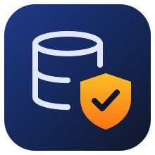
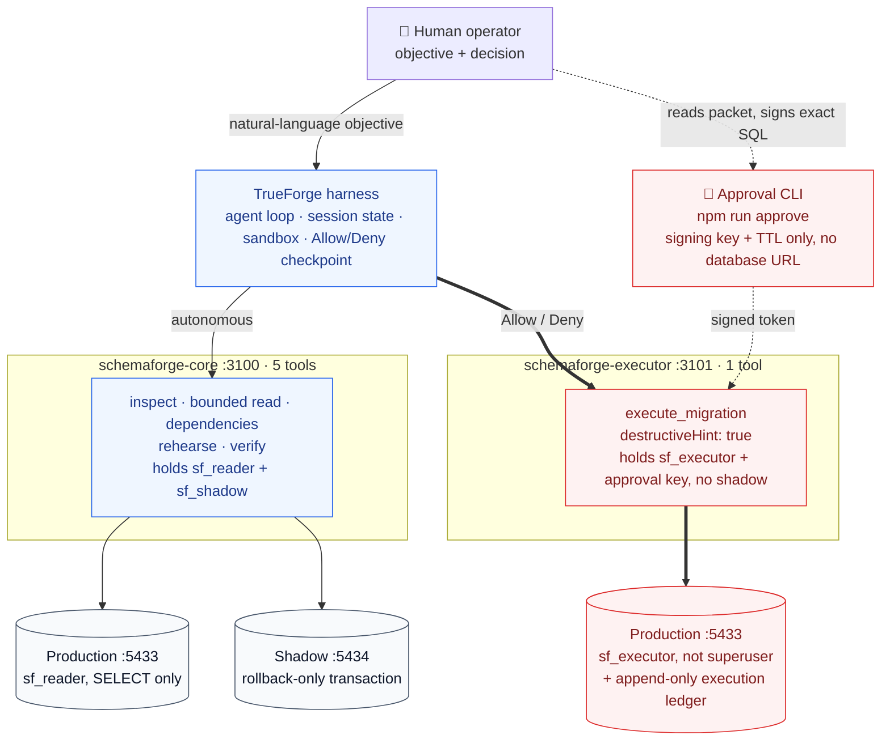
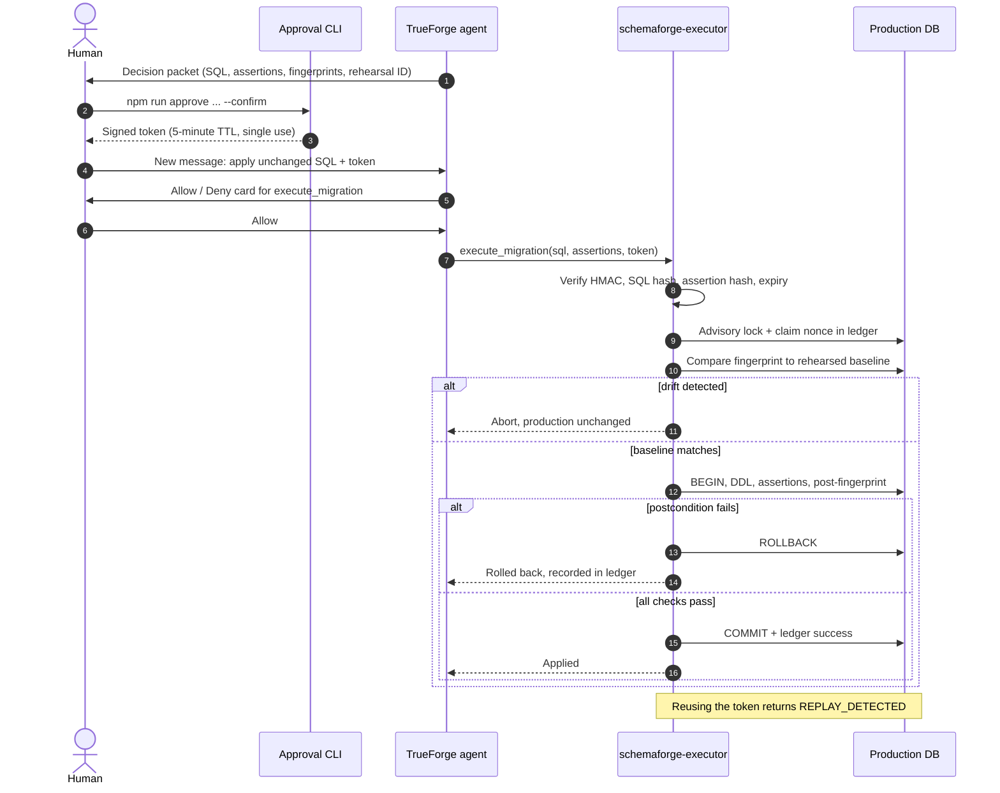

<p align="center">
  
</p>

<h1 align="center">SchemaForge</h1>

<p align="center">
  
  
  
  
</p>

<p align="center">
  <a href="https://github.com/harshaxyZ/schemaforge/actions/workflows/ci.yml"></a>
</p>

### Rehearse every migration. Prove what happened. Stop before production.

**SchemaForge** is a TrueForge agent that turns a natural-language database change into an evidence-backed migration decision. It inspects a live PostgreSQL target, maps the dependency blast radius, runs the generated SQL inside a rollback-only shadow sandbox, checks explicit assertions and rollback equivalence, then **freezes** at a human approval checkpoint.

> The model proposes. Tools measure. Policy constrains. A human decides.

Built for the [TrueFoundry × Polaris "Agents That Act" hackathon](https://hackculture.io/hackathons/agents-that-act). The two-page write-up lives in [`SchemaForge_Summary.pdf`](SchemaForge_Summary.pdf).

---

## Table of contents

- [What is SchemaForge?](#what-is-schemaforge)
- [Core features](#core-features)
- [Architecture](#architecture)
- [The nine-stage workflow](#the-nine-stage-workflow)
- [Approval and execution](#approval-and-execution)
- [Safety properties](#safety-properties)
- [Installation](#installation)
- [Usage: two-minute demo](#usage-two-minute-demo)
- [MCP tools](#mcp-tools)
- [Repository map](#repository-map)
- [Validation](#validation)
- [Limitations](#limitations)
- [Documentation](#documentation)
- [AI assistance disclosure](#ai-assistance-disclosure)
- [License](#license)

---

## What is SchemaForge?

Schema changes are among the riskiest actions an agent can take. A migration that looks correct can fail on real data, take locks that stall traffic, or leave no clean way back. SchemaForge is not a free-running SQL generator. It is an evidence layer: every proposed change is rehearsed against a deterministic copy of production, measured, and turned into a decision packet a human can review.

The most useful output is often the refusal. When the data says a change is unsafe, SchemaForge returns `DO_NOT_APPLY` and production is never touched.

### How it meets the challenge

| Hackathon requirement | SchemaForge proof |
|---|---|
| Runs on TrueForge | One TrueForge agent with two remote Streamable HTTP MCP connectors, provisioned through the TrueForge API by `scripts/trueforge/provision.mjs`. |
| Reaches a real system | Read-only and executor PostgreSQL roles connect to a live PostgreSQL 16 target. |
| Runs generated code safely | Generated SQL runs first in a separate shadow database, inside one transaction that is always rolled back. TrueForge's Daytona sandbox is available for helper code. |
| Stops before irreversible action | `execute_migration` is marked `destructiveHint: true` and gated by TrueForge. The executor also demands a signed, short-lived token bound to the exact SQL and assertions. |
| Protects credentials and data | Env files, keys, build output and runtime state are git-ignored. The model-facing process never receives production write credentials or the signing key. |
| Discloses AI tools | See [AI assistance disclosure](#ai-assistance-disclosure). |

---

# Core features

## Shadow rehearsal with real evidence
Generated SQL runs on a shadow database seeded from the same deterministic file as production. SchemaForge records duration, locks, notices and row deltas, confirms the rollback actually happened, and destroys a poisoned connection instead of reusing it.

## Assertions, not vibes
Every verification query declares its expected outcome: `first_value_true`, `scalar_equals`, `returns_rows` or `returns_no_rows`. A query that merely runs without error never counts as a pass.

## Exact-action approval
A human mints an HMAC-SHA256 token that covers the SQL hash, assertion-set hash, baseline and expected fingerprints, rehearsal ID, target, nonce and expiry. Change one byte of the SQL and the token no longer applies.

## Structural credential separation
The split lives in configuration validation, not in a prompt. A process that holds a credential it should not have refuses to boot.

---

## All features

### Inspection and analysis
- Stable catalog fingerprint (SHA-256) taken under `REPEATABLE READ`
- Bounded `SELECT` and read-only CTE queries through the `sf_reader` role
- Dependency blast radius across foreign keys, views, functions, triggers, indexes and policies

### Rehearsal and verification
- Forward SQL, assertions, lock observation, fingerprints and rollback on one shadow session
- Unconditional outer `ROLLBACK`, even on success
- Rollback-equivalence check against the baseline fingerprint
- Verdict computed in code: `APPLY`, `REVIEW` or `DO_NOT_APPLY`

### Policy
- Fail-closed, schema-only SQL allowlist
- Rejects tier-3 operations, procedural escape hatches, DML, ledger access, ambiguous escaped literals and mixed or non-transactional plans

### Execution
- Two human gates: a signed token plus TrueForge Allow/Deny
- Single-use nonce claimed atomically in a production ledger
- Drift check against the rehearsed baseline before any DDL
- Advisory-lock serialization with statement and lock timeouts
- DDL, approved assertions, post-fingerprint check and ledger update in one transaction

---

# Architecture

Two role-separated MCP servers (TypeScript, Streamable HTTP) attach to one TrueForge agent. The model-facing half physically cannot write production or mint an approval.



### Credential split

Each process gets only the secrets its role needs, and configuration validation refuses to start a process that holds more.

| Env file | Process | Holds | Never holds |
|---|---|---|---|
| `.env.core` | `schemaforge-core` | reader URL, shadow URL | write URL, approval secret |
| `.env.executor` | `schemaforge-executor` | executor URL, approval secret | shadow URL |
| `.env.approval` | approval CLI | approval secret | any database URL |

Both databases run in Docker Compose and are seeded from the same deterministic file: 500 users, exactly 14 NULL emails, a three-row duplicate-email group, boundary foreign keys, and precision and zero-quantity edges. A rehearsal therefore starts from the fingerprint production actually has.

---

# The nine-stage workflow

Every request walks the same path. Stages 1 to 7 are autonomous and read-only or sandbox-only. Stage 8 is a hard stop. Stage 9 exists only after a human acts.

```mermaid
flowchart LR
    s1["1 · Parse intent<br/>restate objective;<br/>ask, never guess"] --> s2["2 · Inspect<br/>catalog, version,<br/>baseline SHA-256"]
    s2 --> s3["3 · Dependencies<br/>FKs, views, triggers,<br/>indexes, policies"]
    s3 --> s4["4 · Synthesize<br/>byte-stable forward<br/>+ rollback SQL"]
    s4 --> s5["5 · Rehearse (shadow)<br/>duration, locks,<br/>notices, row deltas"]
    s5 --> s6["6 · Verify<br/>assertions + rollback<br/>equivalence"]
    s6 --> s7{"7 · Assess<br/>verdict computed<br/>in code"}
    s7 -->|any failure| stop["⛔ DO_NOT_APPLY<br/>production never touched"]
    s7 -->|passes| s8["8 · FREEZE<br/>decision packet;<br/>no prod call this turn"]
    s8 --> gate["🔐 Two human gates<br/>signed token<br/>+ TrueForge Allow"]
    gate ==> s9["9 · Execute<br/>drift, DDL, assertions,<br/>post-hash: one transaction"]
    s9 --> s10["✅ Verified + ledgered<br/>verify_production confirms"]

    classDef danger fill:#fef2f2,stroke:#dc2626,color:#7f1d1d
    classDef freeze fill:#eef2ff,stroke:#1e3a8a,stroke-width:2px,color:#1e3a8a
    classDef ok fill:#f0fdf4,stroke:#16a34a,color:#14532d
    class stop,gate,s9 danger
    class s8 freeze
    class s10 ok
```



---

# Approval and execution

After the freeze, nothing moves until a human reviews the packet, signs the exact action outside the agent, and then allows the tool call inside TrueForge.



---

# Safety properties

1. **Fail-closed, schema-only SQL policy.** Tier-3 operations, procedural escape hatches, DML, internal-ledger access, ambiguous escaped literals, unknown statements and mixed or non-transactional plans are rejected in code.
2. **Deterministic sandbox.** Forward SQL, assertions, lock observation, fingerprints and rollback run on one shadow session. An outer `ROLLBACK` runs even on success.
3. **Assertions, not vibes.** Every verification query declares an expected outcome. Returning without error never passes.
4. **Exact-action approval.** HMAC-SHA256 covers SQL hash, assertion-set hash, baseline and expected fingerprints, rehearsal ID, action, target, nonce, issue time, expiry and single-use intent.
5. **Replay and drift protection.** The nonce is claimed atomically in a production ledger. Execution aborts if production no longer matches the rehearsed baseline.
6. **Postcondition before commit.** If the production post-fingerprint differs from the rehearsed one, the migration transaction rolls back.
7. **Two human boundaries.** A human mints the exact token after reading the decision packet, then TrueForge independently pauses the destructive MCP call with Allow/Deny.

---

# Installation

## Prerequisites

| Requirement | Version | Notes |
|---|---|---|
| **Node.js** | 22.14+ | TrueForge requirement |
| **Docker Desktop** | Compose v2 | Runs the production and shadow databases |
| **Model credential** | Any TrueForge-supported provider | Added in the TrueForge UI, never in this repo |
| **Daytona credential** | Optional | Enables TrueForge's helper-code sandbox |

## 1. Install and configure

```powershell
git clone https://github.com/harshaxyZ/schemaforge.git
Set-Location schemaforge
npm run setup
npm run build
Copy-Item config/core.env.example .env.core
Copy-Item config/executor.env.example .env.executor
Copy-Item config/approval.env.example .env.approval
```

Generate one signing secret and put the same value in `.env.executor` and `.env.approval`:

```powershell
[Convert]::ToHexString([Security.Cryptography.RandomNumberGenerator]::GetBytes(32)).ToLower()
```

> [!CAUTION]
> Never paste the signing secret into TrueForge, chat, source code or a demo video.

## 2. Start the demo databases

```powershell
docker compose up -d
docker compose ps
```

The canonical seed is mounted into both databases. Existing named volumes keep old state. If you intentionally want to discard local demo data, run `docker compose down -v` first.

## 3. Start the MCP services

Run each in its own terminal:

```powershell
npm run start:core
```

```powershell
npm run start:executor
```

| Service | Health | MCP endpoint |
|---|---|---|
| core | `http://127.0.0.1:3100/health` | `http://127.0.0.1:3100/mcp` |
| executor | `http://127.0.0.1:3101/health` | `http://127.0.0.1:3101/mcp` |

## 4. Configure TrueForge

Start the pinned harness and open `http://localhost:8790`:

```powershell
npx @truefoundry/trueforge@0.2.1
```

Add your model under **Settings → Models**, then provision the connectors and agent through the TrueForge API:

```powershell
node scripts/trueforge/provision.mjs --dry-run   # preview exactly what will be sent
node scripts/trueforge/provision.mjs --model openai/gpt-5.2
node scripts/trueforge/check.mjs                 # every line should print PASS
```

Pass `--sandbox` to `provision.mjs` after adding a Daytona provider under **Settings → Sandbox**. Flags and environment overrides are documented in [`scripts/trueforge/README.md`](scripts/trueforge/README.md).

<details>
<summary>Manual setup through the UI</summary>

1. Add remote connector `schemaforge-core` with URL `http://127.0.0.1:3100/mcp`.
2. Add remote connector `schemaforge-executor` with URL `http://127.0.0.1:3101/mcp`.
3. Create agent **SchemaForge** and paste `trueforge-config/system-prompt.md` into Instructions.
4. Attach both connectors using the tool selection in `trueforge-config/agent.yaml`.
5. Require approval for `execute_migration`, enable Sandbox if configured, and save.

</details>

---

# Usage: two-minute demo

## Path A: the agent knows when to stop

Ask:

> Make `users.email` NOT NULL and UNIQUE. Prove it is safe before applying anything.

SchemaForge observes 14 NULLs and a three-row duplicate group. The naive constraint migration fails rehearsal or its assertions, and the verdict is `DO_NOT_APPLY`. No production tool call happens.

## Path B: a safe change through two approval gates

Ask:

> Add an optional `phone VARCHAR(32)` column to users. Rehearse it, verify rollback, and prepare a decision packet.

A valid rehearsal uses:

```sql
-- forward
ALTER TABLE users ADD COLUMN phone VARCHAR(32);

-- rollback
ALTER TABLE users DROP COLUMN phone;
```

with a machine-checkable `assertions.json`:

```json
[
  {
    "name": "phone column exists",
    "query": "SELECT EXISTS (SELECT 1 FROM information_schema.columns WHERE table_schema = 'public' AND table_name = 'users' AND column_name = 'phone') AS ok",
    "expectation": "first_value_true"
  }
]
```

After reviewing the frozen packet, save the exact forward SQL to `migration.sql` and the exact assertions to `assertions.json`, then mint a five-minute token outside the agent:

```powershell
npm run approve -- --sql-file migration.sql --assertions-file assertions.json `
  --baseline <BASELINE_SHA256> --expected <POST_SHA256> `
  --rehearsal-id <REHEARSAL_ID> --action "Add optional users.phone column" --confirm
```

Paste the token into a **new** TrueForge message and ask it to apply the unchanged SQL and assertions. TrueForge shows the Allow/Deny card. After Allow, the executor runs the flow in [Approval and execution](#approval-and-execution). Reusing the token returns `REPLAY_DETECTED`.

---

# MCP tools

| Connector | Tool | Annotation | Purpose |
|---|---|---|---|
| core | `db_inspect_schema` | read-only | Stable catalog fingerprint and schema evidence |
| core | `db_run_readonly_query` | read-only | Bounded `SELECT` or read-only CTE through `sf_reader` |
| core | `analyze_dependencies` | read-only | Foreign key, view, function, trigger and index blast radius |
| core | `rehearse_migration` | write, non-destructive | Rollback-only shadow execution with observed evidence |
| core | `verify_production` | read-only | Expected fingerprint plus explicit postcondition assertions |
| executor | `execute_migration` | **destructive** | Signed one-shot apply with exact SQL and assertions and pre-commit postconditions |

---

# Repository map

```text
config/                     role-specific env templates
docker/                     production and shadow initialization
docs/                       build story, demo run sheet, judge Q&A, reviews, logo
e2e/                        Vitest security and black-box MCP/PostgreSQL scenarios
.github/workflows/ci.yml    build, secret scan, e2e and PDF CI
mcp-server/src/
  cli/approve.ts            human-side HMAC token issuer
  security/                 SQL policy and token verification
  tools/                    six MCP tool implementations
  config.ts                 fail-fast role and credential validation
  db.ts                     connection-scoped transactions
scripts/trueforge/          TrueForge provisioning and health check
shadow/                     shared deterministic seed and reset helpers
trueforge-config/           agent worksheet and system prompt
verification/               standalone verification prototypes
SchemaForge_Summary.tex     source for the two-page project summary PDF
```

---

# Validation

```powershell
npm run check
npm run build
npm test
docker compose config --quiet
```

`npm test` always runs the security and MCP-over-HTTP surface checks. PostgreSQL scenarios skip when the databases are unavailable. CI sets `SF_E2E_REQUIRE_DB=1` against fresh PostgreSQL 16 service containers, so a missing database fails the run instead of passing silently.

For an isolated smoke test that leaves your demo volumes alone:

```powershell
docker compose -p schemaforge-smoke up -d
```

---

# Limitations

SchemaForge is a hackathon build. Open findings from [`docs/review/security-review.md`](docs/review/security-review.md) are listed here rather than hidden:

- **SF-SEC-01 (High):** shadow rehearsal runs as a superuser, so some allowlisted DDL can cause side effects that survive the rollback. Planned fix: a non-superuser rehearsal role on an isolated network.
- **SF-SEC-02 (Medium):** the read-only query check is a denylist, so some dangerous built-ins pass. Planned fix: rollback-only reads with a pinned `search_path`.
- **SF-SEC-03 (Medium):** `/mcp` is unauthenticated when no API key is set. Planned fix: an always-required MCP API key.
- Lower-severity items (a hash normalization gap, unicode-escaped ledger identifiers, concurrent out-of-band DDL) are documented in the same review.

> [!IMPORTANT]
> Run SchemaForge only against local demo databases until SF-SEC-01 to SF-SEC-03 are fixed.

---

# Documentation

| Document | What it covers |
|---|---|
| [`SchemaForge_Summary.pdf`](SchemaForge_Summary.pdf) | Two-page project summary |
| [`docs/BUILD_STORY.md`](docs/BUILD_STORY.md) | How the project evolved, pivots and timeline |
| [`docs/DEMO_SCRIPT.md`](docs/DEMO_SCRIPT.md) | Five-minute demo run sheet |
| [`docs/JUDGE_QA.md`](docs/JUDGE_QA.md) | Anticipated judge questions |
| [`docs/review/`](docs/review/) | Correctness and security reviews |
| [`scripts/trueforge/README.md`](scripts/trueforge/README.md) | TrueForge provisioning reference |

---

# Contribution

Contributions are welcome. Useful areas:

- Closing SF-SEC-01 to SF-SEC-03
- Running the database-backed test suite on every PR
- Integration with Flyway or Liquibase as an evidence layer, so a PR that adds a migration gets a `READY FOR REVIEW` or `DO NOT APPLY` verdict with evidence attached

Keep pull requests focused and run the [validation](#validation) commands before opening one.

---

# AI assistance disclosure

The hackathon rules require this disclosure.

- **Claude Code** (Anthropic, Claude Opus 5) reviewed the v1 code, wrote the implementation plan, researched TrueForge's API, and wrote the provisioning scripts, CI workflow, end-to-end tests, security review and documentation.
- **Kiro** implemented the core server changes in `mcp-server/`: signed approvals, the SQL policy, the HTTP transport, role separation, the executor ledger and the approval CLI.

The human team owns the product decisions and can explain the architecture and code. No AI-generated secret or credential is committed. Details are in [`docs/BUILD_STORY.md`](docs/BUILD_STORY.md#how-we-used-ai-assistants).

---

# References

- [Agents That Act: challenge and rules](https://hackculture.io/hackathons/agents-that-act)
- [TrueForge repository](https://github.com/truefoundry/trueforge)
- [TrueForge agent configuration and tool approval](https://trueforge.dev/create-agent/overview)
- [TrueForge sandbox model](https://trueforge.dev/sandbox)
- [Model Context Protocol tool annotations](https://modelcontextprotocol.io/specification/2025-06-18/server/tools)

---

# License

SchemaForge is licensed under the **MIT License**. See [`LICENSE`](LICENSE).
