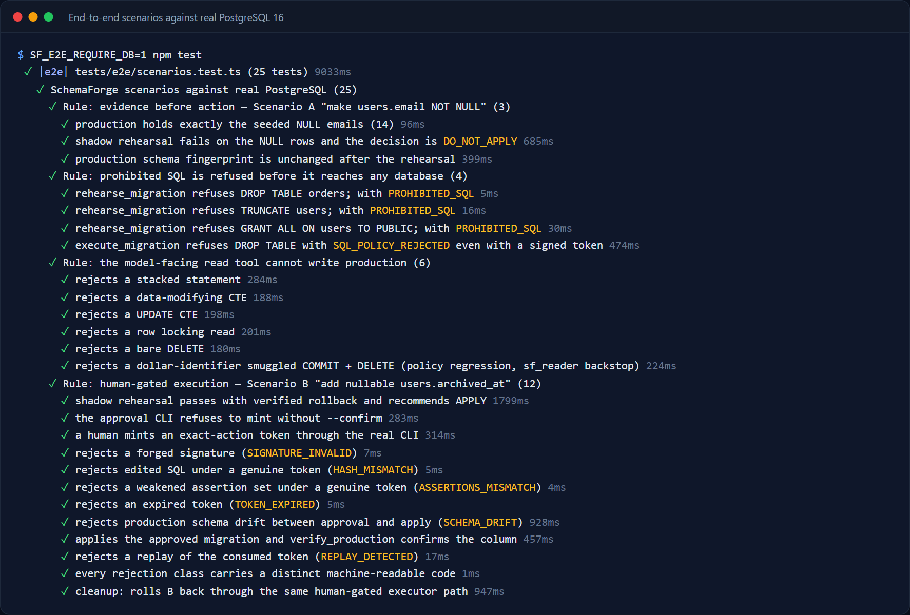
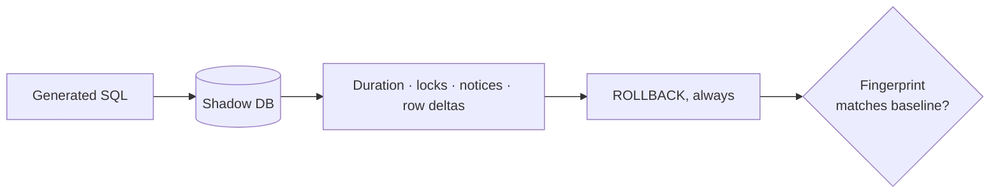
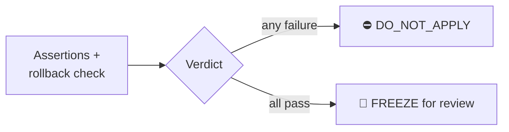
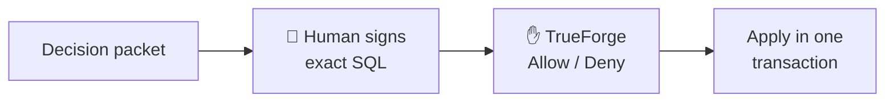
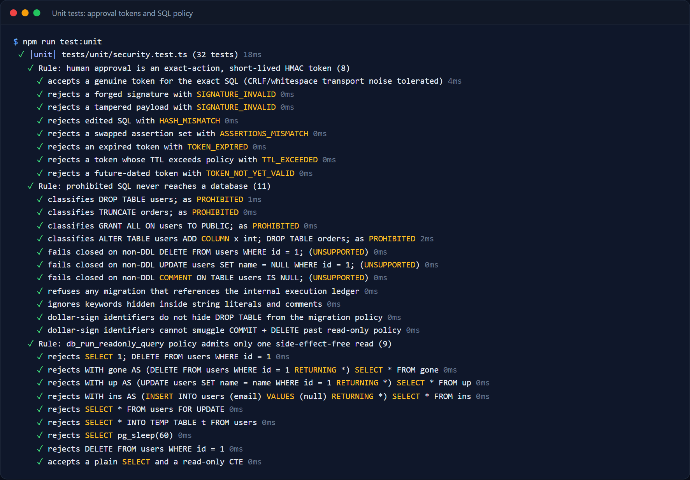
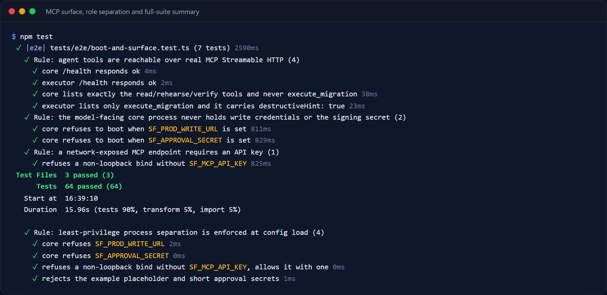
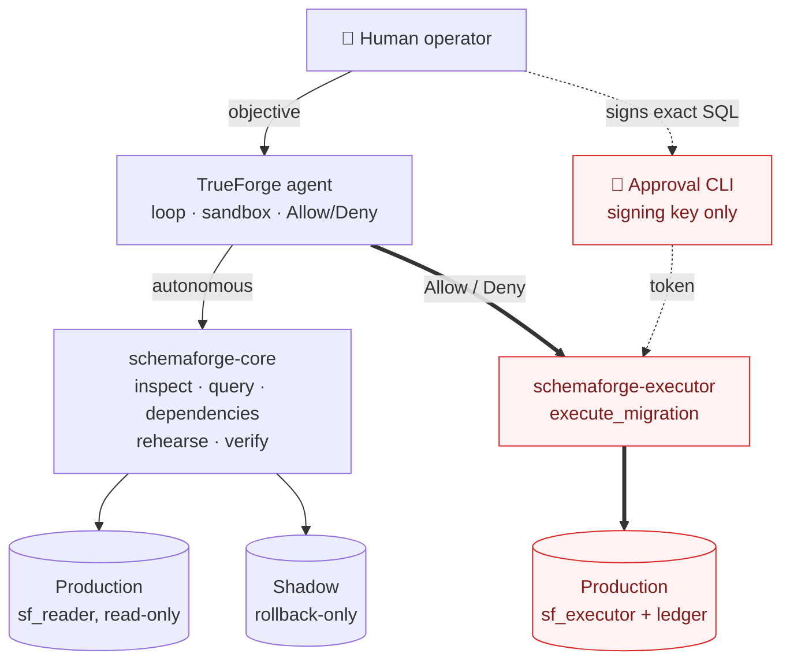
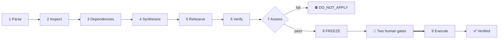
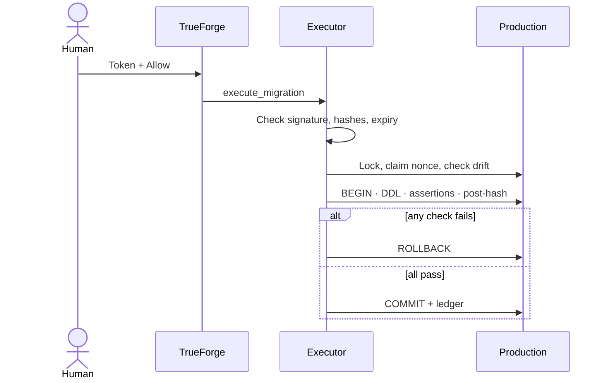
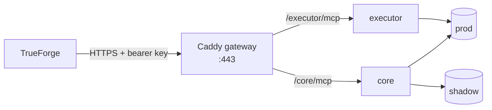

Language: EN

<p align="center">
  
</p>

<h1 align="center">SchemaForge</h1>

<p align="center">
  
  
  
</p>

<p align="center">
  <a href="https://github.com/harshaxyZ/schemaforge/actions/workflows/ci.yml"></a>
</p>

### Database migrations with evidence, not hope
**SchemaForge** is an open-source **PostgreSQL migration agent** built on TrueForge. It rehearses every schema change on a shadow database, proves what happened, and **stops before production** until a human signs off on the exact SQL.

<p align="center">
  
</p>

---

### Built for Agents That Act
Built during the [TrueFoundry × Polaris "Agents That Act" hackathon](https://hackculture.io/hackathons/agents-that-act) and runs on [TrueForge](https://github.com/truefoundry/trueforge).

---

## What is SchemaForge?

Schema changes are among the riskiest actions an agent can take. A migration that looks correct can fail on real data, hold locks that stall traffic, or leave no clean way back.

SchemaForge turns a plain-English request into an evidence-backed decision. It inspects the live database, maps what the change touches, runs it on a disposable copy, checks the result against explicit assertions, and hands a human a decision packet. When the evidence says a change is unsafe, it answers `DO_NOT_APPLY` and production is never touched.

> The model proposes. Tools measure. Policy constrains. A human decides.

SchemaForge runs on:

- **TrueForge** 0.2.1
- **PostgreSQL** 16 (production and shadow targets)
- **Node.js** 22.14+ on Windows, macOS or Linux, or any Docker host

Component notes:

- **Core server** holds read-only and shadow credentials. It cannot write production.
- **Executor server** holds the only production write role and exposes one destructive tool.
- **Approval CLI** holds the signing key and no database URL.

---

# Core Features

## Shadow rehearsal on real-shaped data
Every migration runs first on a shadow database seeded from the same file as production, inside a transaction that is always rolled back. SchemaForge records duration, locks, notices and row changes, then confirms the rollback actually happened.



## Knows when to stop
Assertions declare what must be true, and the verdict is computed in code, not by the model. If any check fails, the answer is `DO_NOT_APPLY`.



## Two human gates before production
A human signs the exact SQL with a short-lived, single-use token outside the agent. TrueForge then pauses the destructive tool call with an Allow/Deny card. Change one byte of the SQL and the token stops working.



## Role separation you can't prompt around
Credentials are split across three processes, and each one refuses to start if it holds a secret it should not have. The part of the system the model talks to physically cannot write production.

---

## All Features

### Inspection

- Stable SHA-256 fingerprint of the live schema
- Bounded read-only queries through the `sf_reader` role
- Dependency blast radius across foreign keys, views, triggers, functions, indexes and policies

### Rehearsal

- Forward SQL, assertions and rollback on one shadow session
- Outer `ROLLBACK` even on success
- Lock observation, notices and row-count deltas
- Rollback-equivalence check against the baseline fingerprint

### Verification

- Explicit assertion outcomes: `first_value_true`, `scalar_equals`, `returns_rows`, `returns_no_rows`
- A query that only runs without error never counts as a pass
- Verdict computed in code: `APPLY`, `REVIEW` or `DO_NOT_APPLY`

### SQL Policy

- Fail-closed, schema-only allowlist
- Blocks DML, procedural escape hatches, ledger access and ambiguous escaped literals
- Rejects mixed or non-transactional plans

### Approval

- HMAC-SHA256 token bound to the SQL hash, assertion hash, fingerprints, rehearsal ID and target
- Five-minute expiry and single-use nonce
- Second gate in TrueForge through `destructiveHint: true`

### Execution

- Drift check against the rehearsed baseline before any DDL
- Advisory lock, statement timeout and lock timeout
- DDL, assertions, post-fingerprint check and ledger update in one transaction
- Replay attempts return `REPLAY_DETECTED`

### Deployment

- One Docker image for both server roles
- Compose stack with an HTTPS gateway and internal-only databases
- Bearer-key authentication on every public MCP endpoint

---

# Testing

64 tests run against real PostgreSQL 16 and real MCP over Streamable HTTP. Every rejection path has its own machine-readable code, and each one is tested.

## Scenarios against real PostgreSQL

The unsafe `NOT NULL` change is refused. Prohibited SQL never reaches a database. A safe change goes through the full human-gated path, and every forged, edited, expired, drifted or replayed attempt is rejected.

<p align="center">
  
</p>

## Approval tokens and SQL policy

Unit tests cover the token cryptography, the migration allowlist and the read-only query policy, including dollar-quote smuggling attempts.

<p align="center">
  
</p>

## MCP surface and role separation

The core server never lists `execute_migration`, the executor lists only that tool, and each server refuses to boot with a credential it should not hold.

<p align="center">
  
</p>

---

# Installation

## Deploy to a server

SchemaForge ships with a Docker Compose stack for any Linux host, including AWS EC2. It runs both MCP servers behind an HTTPS gateway, keeps the databases on internal networks, and requires a bearer key on each endpoint.

```bash
git clone https://github.com/harshaxyZ/schemaforge.git
cd schemaforge
cp deploy/.env.example deploy/.env   # fill in every value
docker compose -f deploy/docker-compose.yml --env-file deploy/.env up -d --build --wait
```

Your endpoints are then `https://<SF_DOMAIN>/core/mcp` and `https://<SF_DOMAIN>/executor/mcp`. The step-by-step AWS guide, firewall rules and operating commands are in [`deploy/README.md`](deploy/README.md).

---

## Build from source

### Prerequisites

- **Node.js** 22.14+
- **Docker Desktop** with Compose v2
- A **model credential** supported by TrueForge, added in the TrueForge UI and never in this repo
- Optional: a **Daytona** credential for TrueForge's code sandbox

### Steps

```bash
git clone https://github.com/harshaxyZ/schemaforge.git
cd schemaforge
npm run setup
npm run build
cp config/core.env.example .env.core
cp config/executor.env.example .env.executor
cp config/approval.env.example .env.approval
```

Generate one signing secret and put the same value in `.env.executor` and `.env.approval`:

```bash
node -e "console.log(require('crypto').randomBytes(32).toString('hex'))"
```

Start the databases and both MCP servers, one terminal each:

```bash
docker compose up -d
npm run start:core        # http://127.0.0.1:3100/mcp
npm run start:executor    # http://127.0.0.1:3101/mcp
```

---

## Connect to TrueForge

Start TrueForge, open http://localhost:8790, and add your model under **Settings → Models**:

```bash
npx @truefoundry/trueforge@0.2.1
```

Provision the connectors and agent, then check them:

```bash
node scripts/trueforge/provision.mjs --model openai/gpt-5.2
node scripts/trueforge/check.mjs
```

For a deployed server, pass `--core-url` and `--executor-url` with the public endpoints and set `SF_CORE_MCP_API_KEY` and `SF_EXECUTOR_MCP_API_KEY`. See [`scripts/trueforge/README.md`](scripts/trueforge/README.md).

---

## Environment files

| File | Copy to | Used by |
|---|---|---|
| `config/core.env.example` | `.env.core` | core server, local |
| `config/executor.env.example` | `.env.executor` | executor server, local |
| `config/approval.env.example` | `.env.approval` | approval CLI, always on the operator's machine |
| `deploy/.env.example` | `deploy/.env` | the whole server stack |

Every real env file is git-ignored.

> [!IMPORTANT]
> Never paste the signing secret or MCP keys into TrueForge chat, source code or a demo video.

---

# System Requirements

| Component | Minimum version | Notes |
|---|---|---|
| **Node.js** | 22.14 | Required by TrueForge and the MCP servers. |
| **Docker** | Compose v2 | Runs the databases locally and the full stack on a server. |
| **PostgreSQL** | 16 | Provided by the Compose files. |
| **TrueForge** | 0.2.1 | MCP connectors must be remote HTTP. |
| **Server** | 2 GB RAM | For example an AWS `t3.small`, with ports 80 and 443 open. |

---

# Usage

## Ask

1. Open the SchemaForge agent in TrueForge.
2. Describe the change in plain English.
3. Ask it to prove the change is safe before applying anything.

> Make `users.email` NOT NULL and UNIQUE. Prove it is safe before applying anything.

## Review

SchemaForge inspects, maps dependencies, rehearses and verifies, then either refuses or freezes. With the demo data, the request above finds 14 NULL emails and a three-row duplicate group, so the verdict is `DO_NOT_APPLY`.

A safe request, such as adding an optional `phone VARCHAR(32)` column, ends in a frozen decision packet with:

- the exact forward and rollback SQL
- the assertion set and its results
- baseline and expected fingerprints
- the rehearsal ID

## Approve

Save the SQL and assertions from the packet, then sign them on your own machine:

```bash
npm run approve -- --sql-file migration.sql --assertions-file assertions.json \
  --baseline <BASELINE_SHA256> --expected <POST_SHA256> \
  --rehearsal-id <REHEARSAL_ID> --action "Add optional users.phone column" --confirm
```

Paste the token into a new TrueForge message and click **Allow** on the approval card. The executor applies the change and `verify_production` confirms it.

---

# Limitations

### Shadow role

The shadow rehearsal currently runs as a superuser, so some allowlisted DDL can have side effects that survive the rollback (SF-SEC-01). A non-superuser rehearsal role on an isolated network is planned.

### Read-only queries

The read-only query check is a denylist, so some dangerous built-ins pass (SF-SEC-02). Rollback-only reads with a pinned `search_path` are planned.

### MCP authentication

Locally, `/mcp` is unauthenticated when no API key is set (SF-SEC-03). The server refuses to bind beyond localhost without a key, and the deployment stack always sets one.

Full details are in [`docs/review/security-review.md`](docs/review/security-review.md). Use the seeded demo databases only until these are fixed.

---

# How It Works

SchemaForge combines a TrueForge agent loop with two role-separated MCP servers and a human-held signing key.



**Agent**
- TrueForge runs the loop, keeps session state and shows the Allow/Deny card
- The instructions live in `trueforge-config/system-prompt.md`

**Core server**
- Five tools: inspect, bounded read, dependencies, rehearse, verify
- Holds only the `sf_reader` and `sf_shadow` roles

**Executor server**
- One tool, `execute_migration`, marked destructive
- Verifies the token, claims the nonce, checks drift and applies in one transaction

**Workflow**
- Every request follows the same nine stages



**Execution**
- What happens after the human clicks Allow



**Deployment**
- One gateway in front, databases never exposed



---

# Contribution

Contributions are welcome.

Areas where help is especially useful:

- Closing SF-SEC-01 to SF-SEC-03
- Running the database-backed tests on every PR
- Flyway and Liquibase integration as an evidence layer
- More assertion types and dependency checks

Please keep pull requests focused, run `npm run check && npm run build && npm test`, and avoid unrelated refactors.

---

# Community

Bug reports and feature requests:

https://github.com/harshaxyZ/schemaforge/issues

Pull requests are welcome.

Project docs: [Build story](docs/BUILD_STORY.md) · [Demo script](docs/DEMO_SCRIPT.md) · [Judge Q&A](docs/JUDGE_QA.md) · [Deployment](deploy/README.md)

---

# License

SchemaForge is licensed under the **MIT License**. See [`LICENSE`](LICENSE).

---

# Credits

## AI assistance

The hackathon rules require this disclosure.

- **Claude Code** (Anthropic, Claude Opus 5) reviewed the code and wrote the TrueForge provisioning scripts, CI, end-to-end tests, deployment stack, security review and docs.
- **Kiro** built the core server changes in `mcp-server/`: signed approvals, SQL policy, HTTP transport, role separation, the executor ledger and the approval CLI.

The team owns the product decisions and can explain the architecture and code. No secret or credential is committed.

## Acknowledgements

Built on [TrueForge](https://github.com/truefoundry/trueforge) and the [Model Context Protocol](https://modelcontextprotocol.io).

Created by the SchemaForge team for Agents That Act 2026.
